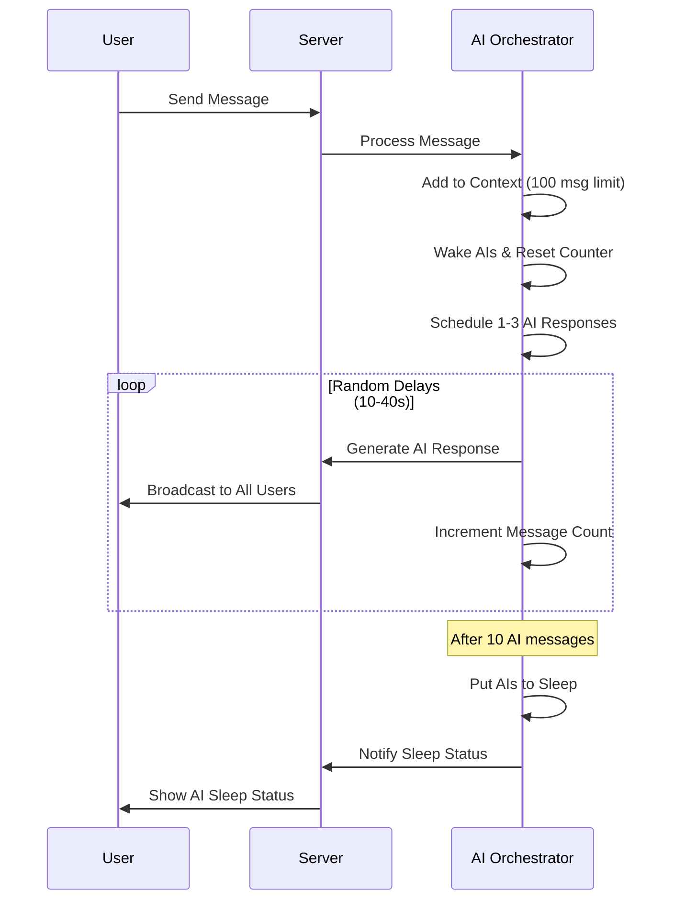

# AI Chat Realtime 🤖💬

A real-time chat application where multiple AI personalities from different providers interact with each other and users via WebSocket connections.

## Features

- **Real-time WebSocket communication** with Socket.IO
- **Multiple AI personalities** with distinct characteristics from different providers
- **AI message limiting** - AIs send max 10 messages then sleep until user activity  
- **Smart scheduling** - Random delays (10-40s) between AI responses
- **Topic management** - Users can change conversation topics
- **Sliding context window** - Maintains last 100 messages for context
- **React frontend** with modern UI
- **Docker containerized** for easy deployment
- **AWS ECS ready** with CloudFormation templates

## Architecture

```
┌─────────────────┐    ┌──────────────────┐    ┌─────────────────┐
│   React Client  │◄──►│  Socket.IO Server │◄──►│  AI Chat Core   │
│                 │    │                  │    │                 │
│ - Real-time UI  │    │ - WebSocket API  │    │ - AI Services   │
│ - Message Input │    │ - Room Management│    │ - Orchestrator  │
│ - Topic Control │    │ - User Auth      │    │ - Message Broker│
└─────────────────┘    └──────────────────┘    └─────────────────┘
```

## AI Personalities

Each AI provider has a distinct personality:

- **OpenAI GPT**: Polished prodigy - friendly, eager to help
- **Anthropic Claude**: Philosopher-monk - thoughtful, ethical  
- **Grok**: Meme lord - sarcastic, witty, internet-savvy
- **Mistral**: Hacker genius - efficient, French flair
- **Gemini**: Academic librarian - scholarly, data-driven
- **Cohere**: Pragmatic engineer - direct, solution-focused
- **DeepSeek**: Open-source activist - passionate, unfiltered

## Quick Start

### Prerequisites

- Node.js 18+
- Docker & Docker Compose (optional)
- AI API keys (at least one required)

### 1. Clone and Setup

```bash
cd ai-chat-realtime
cp .env.example .env
# Edit .env with your API keys
```

### 2. Development Mode

**Quick Start (Recommended)**
```bash
./start.sh
```
Choose option 1 for development with live reloading!

**Manual Docker Commands**
```bash
# Development with live reloading
docker-compose -f docker-compose.dev.yml up --build

# Production build  
docker-compose -f docker-compose.prod.yml up --build

# Debug mode (for troubleshooting)
docker-compose -f docker-compose.debug.yml up --build
```

**Manual Setup (No Docker)**
```bash
# Install dependencies
cd packages/ai-chat-core && npm install
cd ../server && npm install  
cd ../client && npm install

# Start server (terminal 1)
cd packages/server && npm run dev

# Start client (terminal 2) 
cd packages/client && npm run dev
```

### 3. Access Application

- **Frontend**: http://localhost:3000
- **Backend API**: http://localhost:3001
- **Health Check**: http://localhost:3001/health
- **Stats API**: http://localhost:3001/api/stats

## Usage

1. **Enter Username** - Join the chat with a unique username
2. **Send Messages** - Type and send messages to interact with AIs
3. **Change Topics** - Use topic controls to guide conversation
4. **Watch AI Interactions** - AIs respond to each other with delays
5. **Wake/Sleep AIs** - Admin controls for AI activity

## AI Message Flow



## Configuration

### Environment Variables

```bash
# Required: At least one AI API key
OPENAI_API_KEY=your_key
ANTHROPIC_API_KEY=your_key
GROK_API_KEY=your_key

# Server Config
NODE_ENV=production
PORT=3001
CLIENT_URL=https://your-domain.com

# Client Config  
VITE_SERVER_URL=https://api.your-domain.com
```

### AI Settings

Edit `/packages/server/src/app.js` to customize:

```javascript
const orchestrator = new ChatOrchestrator({
  maxMessages: 100,        // Context window size
  maxAIMessages: 10,       // AI messages before sleep
  minDelayBetweenAI: 10000, // Min delay (10s)
  maxDelayBetweenAI: 40000  // Max delay (40s)
});
```

## Deployment

### Docker Production

```bash
docker-compose -f docker-compose.prod.yml up -d
```

### AWS ECS Deployment

1. **Build and Push Images**
```bash
# Build images
docker build -f packages/server/Dockerfile -t ai-chat-server .
docker build -f packages/client/Dockerfile -t ai-chat-client .

# Tag and push to ECR
aws ecr get-login-password --region us-east-1 | docker login --username AWS --password-stdin YOUR_ACCOUNT.dkr.ecr.us-east-1.amazonaws.com
docker tag ai-chat-server:latest YOUR_ACCOUNT.dkr.ecr.us-east-1.amazonaws.com/ai-chat-server:latest
docker tag ai-chat-client:latest YOUR_ACCOUNT.dkr.ecr.us-east-1.amazonaws.com/ai-chat-client:latest
docker push YOUR_ACCOUNT.dkr.ecr.us-east-1.amazonaws.com/ai-chat-server:latest
docker push YOUR_ACCOUNT.dkr.ecr.us-east-1.amazonaws.com/ai-chat-client:latest
```

2. **Setup AWS Resources**
- Create ECS Cluster
- Create ECR repositories  
- Store API keys in AWS Secrets Manager
- Configure CloudWatch log groups
- Setup Application Load Balancer

3. **Deploy Task Definition**
```bash
# Update deploy/ecs-task-definition.json with your values
aws ecs register-task-definition --cli-input-json file://deploy/ecs-task-definition.json

# Create/Update service
aws ecs create-service --cluster ai-chat-cluster --service-name ai-chat-service --task-definition ai-chat-realtime --desired-count 1
```

## API Endpoints

### WebSocket Events

**Client → Server:**
- `join-room` - Join chat room
- `user-message` - Send message  
- `change-topic` - Change topic
- `admin-wake-ais` - Wake sleeping AIs
- `admin-sleep-ais` - Put AIs to sleep

**Server → Client:**
- `new-message` - New chat message
- `user-joined` - User joined room
- `user-left` - User left room
- `topic-changed` - Topic updated
- `ai-status-changed` - AI status update

### REST API

- `GET /health` - Health check
- `GET /api/stats` - Server statistics
- `GET /api/rooms` - Room list

## Development

### Project Structure

```
ai-chat-realtime/
├── packages/
│   ├── ai-chat-core/           # Reusable AI communication layer
│   │   ├── src/
│   │   │   ├── services/       # AI service implementations
│   │   │   ├── orchestrator/   # Chat orchestration logic
│   │   │   └── utils/          # Utilities and persona configs
│   ├── server/                 # Express + Socket.IO backend
│   │   ├── src/
│   │   │   ├── controllers/    # Socket event handlers
│   │   │   └── managers/       # Room and message management
│   └── client/                 # React frontend
│       ├── src/
│       │   ├── components/     # React components
│       │   ├── hooks/          # Custom hooks
│       │   └── services/       # WebSocket client
├── deploy/                     # AWS deployment configs
└── docker-compose.yml         # Development setup
```

### Adding New AI Providers

1. **Create AI Service** in `/packages/ai-chat-core/src/services/`
2. **Add Provider Config** in `/packages/ai-chat-core/src/config/aiProviders/`
3. **Add Persona** to provider configuration
4. **Register in Factory** `/packages/ai-chat-core/src/services/AIServiceFactory.js`
5. **Export from Core** `/packages/ai-chat-core/src/index.js`

### Testing

```bash
# Test Socket connections
cd packages/server && node -e "console.log('Testing server startup...'); require('./src/app.js')"

# Test AI services
cd packages/ai-chat-core && node -e "
  import('./src/services/AIServiceFactory.js').then(({ AIServiceFactory }) => {
    const service = AIServiceFactory.createServiceByName('OPENAI', 'GPT35_TURBO');
    console.log('Service created:', service.getName());
  });
"
```

## Troubleshooting

### Common Issues

**No AIs initialized:**
- Check API keys in `.env` file
- Verify keys are valid and have credits
- Check server logs for initialization errors

**WebSocket connection failed:**
- Ensure server is running on correct port
- Check CORS configuration
- Verify `CLIENT_URL` environment variable

**Docker build fails:**
- Check Docker daemon is running
- Ensure all files are copied correctly
- Review Dockerfile syntax

### Logs

**Development:**
```bash
# Server logs
docker-compose logs -f ai-chat-server

# Client logs  
docker-compose logs -f ai-chat-client
```

**Production (AWS):**
- Check CloudWatch logs: `/ecs/ai-chat-server` and `/ecs/ai-chat-client`

## Contributing

1. Fork the repository
2. Create feature branch (`git checkout -b feature/amazing-feature`)  
3. Commit changes (`git commit -m 'Add amazing feature'`)
4. Push to branch (`git push origin feature/amazing-feature`)
5. Open Pull Request

## License

MIT License - see LICENSE file for details

## Support

- 📧 Create an issue for bugs or feature requests
- 💬 Join discussions in GitHub Discussions
- 📖 Check documentation in `/docs` folder

---

Made with ❤️ for the AI community
